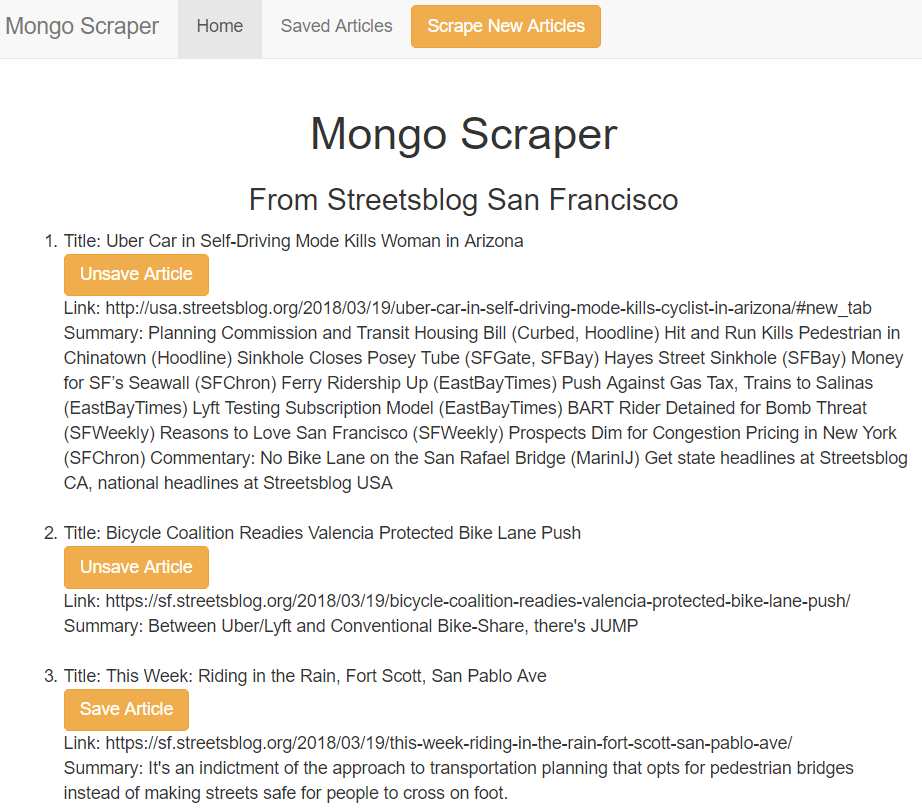
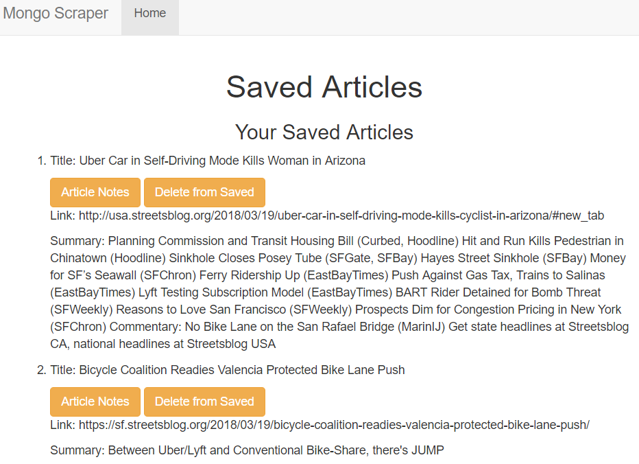
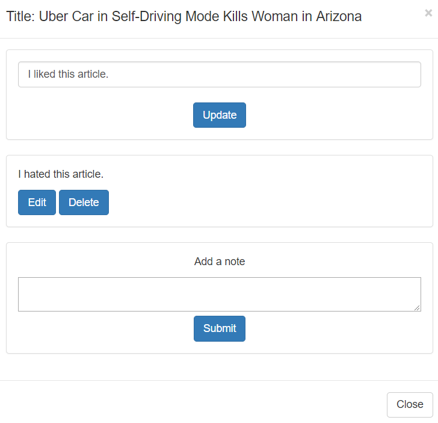

# News Scrape

In this application, you can click the Scrape New Articles button to retrieve news articles from the Streetsblog San Francisco website. This information includes the article title, URL, and summary. After the articles are retrieved, you can click the Save Article button to save an article on the Saved Articles page. From the Saved Articles page, you can click the Article Notes button to add, update, and delete notes about an article. You can also click the Delete from Saved button to remove the article from the Saved Articles page. All information about the articles and notes is stored in a database.

The application is deployed at: https://newsscrapecordano.herokuapp.com/

# Sample Screenshots

The following image shows the home page for the application where you click the Scrape New Articles button to see the news articles.  

You can click the Saved Articles link on this page to navigate to the Saved Articles page. The following image shows the Saved Articles page.

You can click the Article Notes button for an article on this page to open a note window for the article. The following image shows a note window in which a previous user entered an "I hated this article" note and the current user is ready to update an "I liked this article" note.

# Tools Used

- JavaScript
- html
- Bootstrap
- node.js
- jQuery
- Heroku
- npm packages:
	- express
	- express-handlebars
	- body-parser
	- mongoose
	- cheerio
	- request 